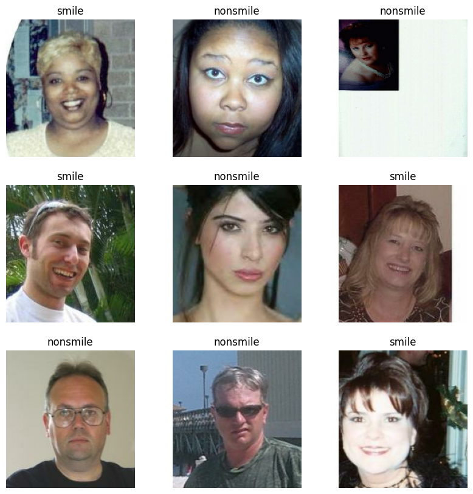
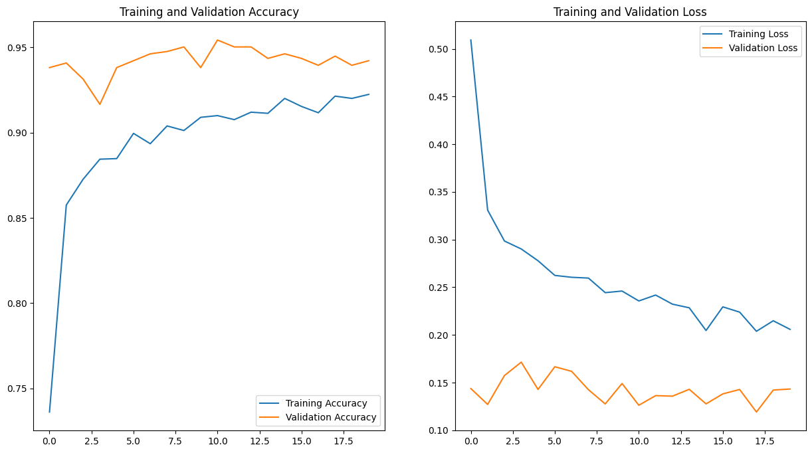

# Smile Detection with Deep Learning

A deep learning project that detects smiles in images and video streams using transfer learning and face detection.


https://github.com/user-attachments/assets/68d41edc-39c8-4508-8c64-0b9975511caf


<!--  -->
<figure style="text-align:center">
    
    <figcaption>
    Sample images from the dataset showing smile and non-smile classifications
    </figcaption>
</figure>

## Overview

This project implements a real-time smile detection system using deep learning. It can process:
- Live webcam feed
- Video files
- Static images

The system first detects faces using [MTCNN](https://github.com/ipazc/mtcnn) and then classifies each detected face as "smile" or "nonsmile" using a custom-trained neural network.

<figure style="text-align:center">
    
    <figcaption>
    Face detection results using MTCNN
    </figcaption>
</figure>

<figure style="text-align:center;">

<div style="column-gap:2rem;display:flex;align-items:center;justify-content:center;margin: 1rem 0;">
    
    <figcaption>
    
</div>
<figcaption>
A) An image from dataset where more than one faces are present; B) The detected faces
</figcaption>
</figure>

## Features

- Real-time face detection and smile classification
- Support for multiple faces in a single frame
- Video file processing with output saving
- Transfer learning using pre-trained models
- Custom data preprocessing pipeline

## Technical Details

The project uses:
- TensorFlow for deep learning
- MTCNN for face detection
- OpenCV for image and video processing
- Transfer learning from existing emotion detection models

### Model Training

The model was trained using transfer learning, building upon existing emotion detection architectures. The training process included:
- Face cropping from the original dataset
- Data augmentation (random flips and rotations)
- Custom preprocessing including RGB to grayscale conversion


*Model training results showing accuracy and loss over time*

## Getting Started

### Prerequisites

```bash
pip install tensorflow opencv-python mtcnn pillow pandas numpy
```

### Usage

First download the dataset and put it inside a folder named dataset in the root directory. The structure of this folder will be:  
dataset/  
├── files/  
│   ├── nonsmile/  
│   └── smile  
├── labels.txt  
└── README  

Then use the `detect_and_save_face()` method to crop and save the faces only.

Then you can predict using:

```python
# Initialize
fd = FaceDetection()

# Process webcam feed
fd.predict_from_camera()

# Process video file
fd.predict_from_video("input.mp4", "output.mp4")

# Process single image
fd.predict_image("image.jpg")
```

## Dataset

The project uses the [GENKI-4K dataset](https://www.kaggle.com/datasets/talhasar/genki4k), which contains labeled face images for smile detection training and validation.
